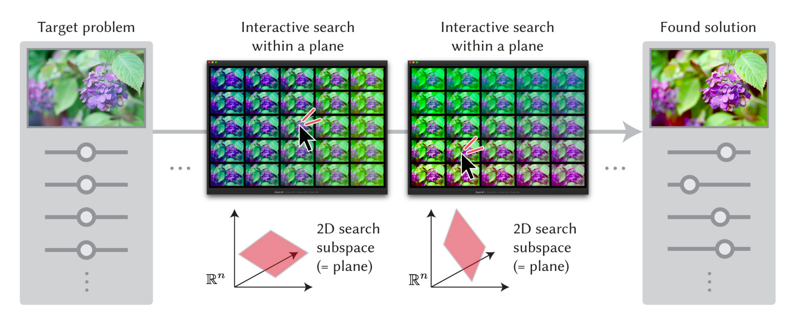
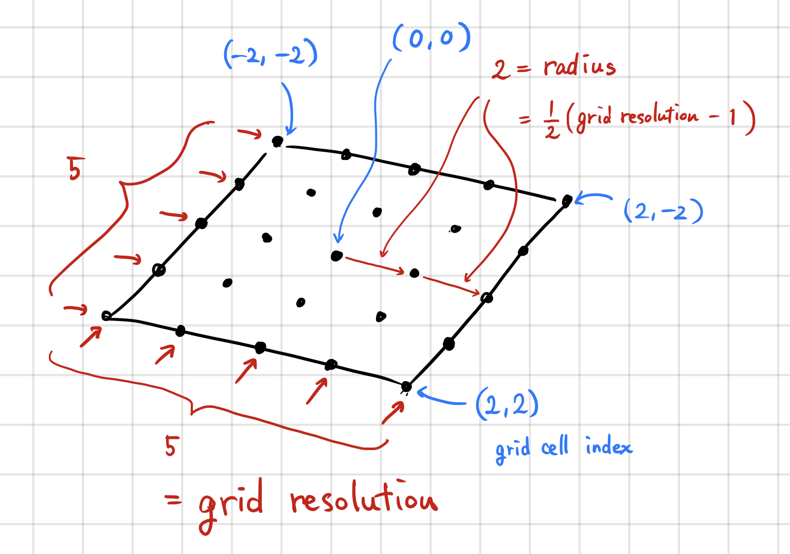

# Sequential Gallery

[](https://github.com/yuki-koyama/sequential-gallery/actions/workflows/macos.yml)
[](https://github.com/yuki-koyama/sequential-gallery/actions/workflows/ubuntu.yml)
[](https://github.com/yuki-koyama/sequential-gallery/actions/workflows/macos-python.yml)
[](https://github.com/yuki-koyama/sequential-gallery/actions/workflows/ubuntu-python.yml)
[](https://github.com/yuki-koyama/sequential-gallery)

This repository offers an implementation of *Sequential Gallery* and a library for its core algorithm, *sequential plane search*. It is about a human-in-the-loop Bayesian optimization; see our SIGGRAPH 2020 paper for details.



This repository includes the followings.
- `sps`: a C++ library for the sequential-plane-search algorithm, which is an extension of preferential Bayesian optimization [Brochu+, NIPS 2007; Koyama+, SIGGRAPH 2017].
- `sequential-gallery`: a desktop application combining the sequential-plane-search algorithm and a grid-view interface for achieving efficient human-in-the-loop visual design optimization.
- `pysps`: Python bindings of `sps`.

## Publication

Yuki Koyama, Issei Sato, and Masataka Goto. 2020. Sequential Gallery for Interactive Visual Design Optimization. ACM Trans. Graph. 39, 4 (July 2020), pp.88:1--88:12. DOI: https://doi.org/10.1145/3386569.3392444

The software is provided mainly for researchers who want to use or extend the method described in the above paper. We also expect that the software is useful for developers who plan to use the method in their software.

## Project Page

https://koyama.xyz/project/sequential_gallery/

## Dependencies

Library (`sps`):
- sequential-line-search https://github.com/yuki-koyama/sequential-line-search (git submodule)
- Eigen http://eigen.tuxfamily.org/ (`brew install eigen` / `sudo apt install libeigen3-dev`)
- mathtoolbox https://github.com/yuki-koyama/mathtoolbox (git submodule)
- timer https://github.com/yuki-koyama/timer (git submodule)

Application (`sequential-gallery`):
- Qt5 http://doc.qt.io/qt-5/ (`brew install qt@5` / `sudo apt install qt5-default`)
- string-util https://github.com/yuki-koyama/string-util (git submodule)
- visoptslider https://github.com/yuki-koyama/visoptslider (git submodule)
- enhancer https://github.com/yuki-koyama/enhancer (git submodule)

Python bindings (`pysps`):
- pybind11 https://github.com/pybind/pybind11 (git submodule)

Experiment:
- optimization-test-functions https://github.com/yuki-koyama/optimization-test-functions (git submodule)

Test:
- Google Test https://github.com/google/googletest (git submodule)

## Prerequisites

Eigen (3.x.x) and Qt (5.x.x) need to be installed beforehand.

macOS:
```sh
brew install eigen qt@5
```

Ubuntu 18.04:
```sh
sudo apt install libeigen3-dev qt5-default
```

## Build

```sh
git clone https://github.com/yuki-koyama/sequential-gallery.git --recursive
cd sequential-gallery
mkdir build
cd build
cmake ../
make
```

## Implementation Notes



## Code Format

```sh
clang-format -i ./app/*.*pp ./exp/*.*pp ./test/*.*pp ./sps/**/*.*pp ./python-bindings/*.*pp
```

## Copyright

Copyright (c) 2021 National Institute of Advanced Industrial Science and Technology (AIST) - koyama.y@aist.go.jp

## License

MIT License. See the `LICENSE` file for details.

## Contributing

Pull requests are highly welcome. Please be aware that any contribution to this repository will be licensed under the above license condition.
